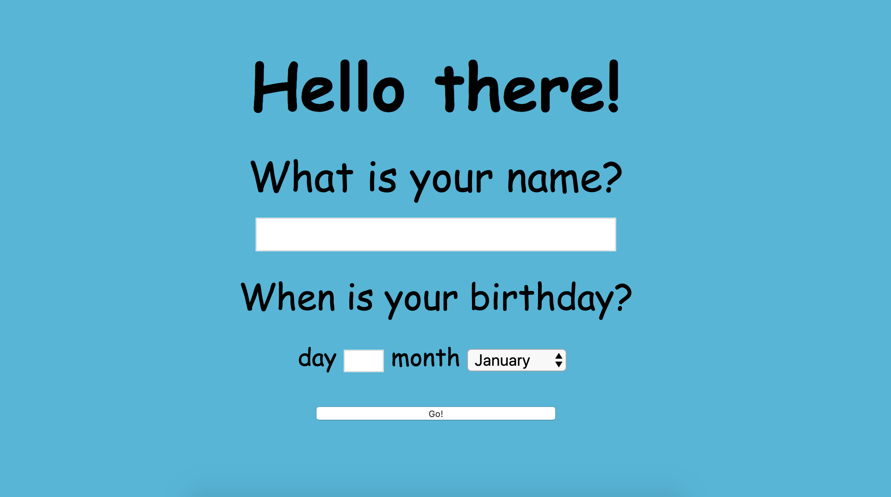

# Birthday Greeter App

This project was my first attempt at developing a Web Application in Ruby.

This birthday greeter app allows the end user to enter their name and birthday. If their Birthday is today's date it sends them a Birthday Greeting, otherwise it tells the user how many days it is until their Birthday.

## Screenshots



## Instructions

* Clone the repo: 
`$  https://github.com/VladC24/Birthday-Greeter.git`

* Run 

```
$  bundle
$  shotgun
```

* Open the browser and type in `localhost: 9393`

## User Stories

```
As a user.
So that I can easily check if it's my birthday.
I'd like to enter a name and date and have it return a birthday greeting or a countdown.
```
## To Continue
If I had more time, I would have written the second part of the program, where it would calculate the number of days left until your birthday and add CSS.